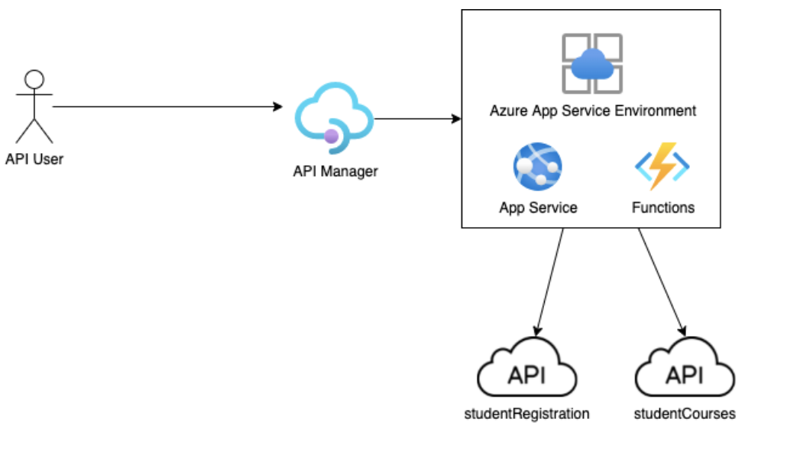

# yu-ssrp-eip-poc-2022-uc01-student-api
A Repository dedicated to usecase 01 of 2022 EIP PoC project within YorkU's SSRP Program

## Use-case Description: 
We will have two APIs - “studentRegistration” and “studentCourses” which we can use to collect data from the student information system. We need to write a composite API which takes sisid and academicyear as parameters. Using the parameters supplied, this app collects data from “studentRegistration” first. If student is registered as a “full time graduate student”, student is determined to be “eligible for graduate housing”. Otherwise, if the student is registered in an undergraduate program, function app calls “studentCourses” to determine the number of credits student is taking in Fall/Winter session. If the student is taking at least 18 credits, student is determined to be “eligible for undergraduate housing”. Otherwise, student is not eligible for housing. Once eligiblity is determined, the functions app returns a json object in the response body showing “sisid”, “eligibility”, “datetime”.  

We should use API Manager to support versioning, token-based access control etc.   

York team will provide the `studentRegistration` and `studentCourses` APIs. They will not have to be built as part of this use case. More details will follow during the development sprint.  

## Success Criteria: 
* Develop an httpTrigger Azure Function app that takes two parameters `sisid` and `academicyear` 
* Function collects data from two APIs `studentRegistration` and `studentCourses` 
* Credentials for `studentRegistration` and `studentCourses` APIs are taken from keyvalult 
* API manager is used to provide access to this API 


## Solution Design: 


## Data Privacy Notice: 
York team will generate the fake data used by the two backend APIs studentRegistration and studentCourses. No real data will be used in this use case. 

## studentRecordsAPI (https://bkgsuj.deta.dev/) details:

* API Authentication 
    - Application uses API Key based authentication
    - Add header `"X-API-Key": "{api-key-from-ssrp-team}"` to your call
* GET studentRegistration by sisid, academicyar 
    - request `GET /studentRegistration/sisid/{sisid}/academicyear/{academicyear}`
    - response: 
    ```json
        [
            {
                "academicyear": 2021,
                "acadqualification": "MA   ",
                "activitylevel": "F",
                "key": "7riq7cm17hrl",
                "progfaculty": "GS",
                "registrationstatus": "RA",
                "seqpersprog": 537187812,
                "sisid": 242554873,
                "studylevel": 1,
                "studysession": "FA",
                "yuarprogtype": "GR"
            },
            {
                "academicyear": 2021,
                "acadqualification": "MA   ",
                "activitylevel": "F",
                "key": "xlvdxmqbkg4n",
                "progfaculty": "GS",
                "registrationstatus": "RA",
                "seqpersprog": 537187812,
                "sisid": 242554873,
                "studylevel": 1,
                "studysession": "WI",
                "yuarprogtype": "GR"
            }
        ]
    ```
* GET studentCourses by sisid, academicyar 
    - request `GET /studentCourses/sisid/{sisid}/academicyear/{academicyear}`
    - response: 
    ```json
    [
        {
            "academicyear": 2021,
            "course": "GS POLS 6145",
            "creditweight": 3,
            "key": "6wt9jr7y1dh1",
            "period": "F ",
            "periodfaculty": "GS",
            "seqcourseenrolment": 341876689,
            "seqpersprog": 537187812,
            "seqxlistcrsview": 343377472,
            "sisid": 242554873,
            "studysession": "FA"
        },
        {
            "academicyear": 2021,
            "course": "GS POLS 6000",
            "creditweight": 3,
            "key": "q0g4xnw588wt",
            "period": "Y ",
            "periodfaculty": "GS",
            "seqcourseenrolment": 291672877,
            "seqpersprog": 537187812,
            "seqxlistcrsview": 682311157,
            "sisid": 242554873,
            "studysession": "FA"
        },
        {
            "academicyear": 2021,
            "course": "GS POLS 6900",
            "creditweight": 3,
            "key": "qkre5mmpcafb",
            "period": "F ",
            "periodfaculty": "GS",
            "seqcourseenrolment": 712835796,
            "seqpersprog": 537187812,
            "seqxlistcrsview": 672563524,
            "sisid": 242554873,
            "studysession": "FA"
        }
    ]
    ```
* See `sample-data/*.csv` files for full list of data to work with


## Requirements: 
* Produce a `housingEligibility` API with one call `GET /housingEligibility/sisid/{sisid}/academicyear/{academicyear}`:
* path parameters `sisid` and `academicyear` are passed to `studentRegistration` call to get registration status of that student int his academicyear
* If it is a graduate tudent who is "RA" in this academic year, we can consider them eligible. To find active full-time graduate student:
    - Given `sisid` and `academicyear`, call `studentRegistration` resource: `GET /studentRegistration/sisid/{sisid}/academicyear/{academicyear}`. You will get a payload that looks similar to this: 
    ```json
    [
            {
                "academicyear": 2021,
                "acadqualification": "MA   ",
                "activitylevel": "F",
                "key": "7riq7cm17hrl",
                "progfaculty": "GS",
                "registrationstatus": "RA",
                "seqpersprog": 537187812,
                "sisid": 242554873,
                "studylevel": 1,
                "studysession": "FA",
                "yuarprogtype": "GR"
            },
            {
                "academicyear": 2021,
                "acadqualification": "MA   ",
                "activitylevel": "F",
                "key": "xlvdxmqbkg4n",
                "progfaculty": "GS",
                "registrationstatus": "RA",
                "seqpersprog": 537187812,
                "sisid": 242554873,
                "studylevel": 1,
                "studysession": "WI",
                "yuarprogtype": "GR"
            }
        ]
    ``` 
    - Check the response payload for `"registrationstatus": "RA"` and `"yuarprogtype": "GR"`
    - Use the first record if the response has more than one record
    - provided record meets above condition, we can determine student is eligible and return following
    - Return: 
    ```json
        {
            "sisid": int,
            "eligibility": "Eligible - Graduate Housing",
            "datetime": datetime
        }
    ```
    - if student is not eligible, go to next step

* Check if student is active full-time undergraduate student
    - Given `sisid` and `academicyear`, call `studentCourses` resource: `GET /studentCourses/sisid/{sisid}/academicyear/{academicyear}`. 
    - You will get a payload that looks like this: 
    ```json
    [
        {
            "academicyear": 2021,
            "course": "GS POLS 6145",
            "creditweight": 3,
            "key": "6wt9jr7y1dh1",
            "period": "F ",
            "periodfaculty": "GS",
            "seqcourseenrolment": 341876689,
            "seqpersprog": 537187812,
            "seqxlistcrsview": 343377472,
            "sisid": 242554873,
            "studysession": "FA"
        },
        {
            "academicyear": 2021,
            "course": "GS POLS 6000",
            "creditweight": 3,
            "key": "q0g4xnw588wt",
            "period": "Y ",
            "periodfaculty": "GS",
            "seqcourseenrolment": 291672877,
            "seqpersprog": 537187812,
            "seqxlistcrsview": 682311157,
            "sisid": 242554873,
            "studysession": "FA"
        },
        {
            "academicyear": 2021,
            "course": "GS POLS 6900",
            "creditweight": 3,
            "key": "qkre5mmpcafb",
            "period": "F ",
            "periodfaculty": "GS",
            "seqcourseenrolment": 712835796,
            "seqpersprog": 537187812,
            "seqxlistcrsview": 672563524,
            "sisid": 242554873,
            "studysession": "FA"
        }
    ]
    ```
    - Sum up `"creditweight": int` for every record in the response payload
    - If student's creditweight total is 18 or more, student is eligible. Return the following
    - Return:
    ```json
        {
            "sisid": int,
            "eligibility": "Eligible - Undergraduae Housing",
            "datetime": datetime
        }
    ```

* All other cases - student is not eligible, return following: 
    - Return:
    ```json
        {
            "sisid": int,
            "eligibility": "Not Eligible",
            "datetime": datetime
        }    
    ```

